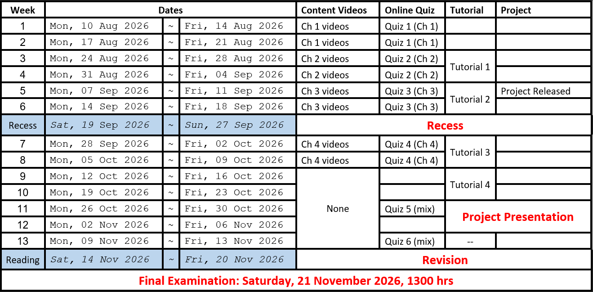

# GEA1000 Quantitative reasoning with data

| assessment | weight |
| --- | --- |
| online quizzes | 10% |
| tutorial participation | 15% |
| group project | 30% |
| final exam | 45% |

# Chapter 1: Getting Data
Population of interest: group in which researcher has interest in drawing conclusions of
- population parameter: numerical fact about a population

Sample: proportion of population selected for study
- estimate: an inference based on information from the sample

Census: an attempt to represent the whole population

## Biases
Selection bias: biased selection of units
- imperfect sampling frame
- non-probability sampling

Non-response bias
- not interested, inconvenient, sensitive information

## Sampling methods
### Probability sampling
Sampled via a known randomized mechanism
- Simple Random - selected randomly **without replacement**
    - good representation but vulnerable to non-response
- Systematic - applying a selection interval k and a random starting point
    - Simpler process, bad representation
- Stratified - similar units grouped into strata, simple random done within each strata
    - Good representation, more information needed
- Cluster - units broken down into similar clusters, randomly sample fixed number of clusters
    - Simpler process, high variability if clusters are dissimilar
### Non-probability sampling
- Convenience - proximity and availability
    - Selection & non-response bias
- Volunteer - actively seek volunteers
    - Selection & non-response bias

## Generalization
For sample statistics to be generalizable
- sampling frame >= population (no one left out)
- probability-based sampling
- large sample size - reduces variability
- minimum non-response
- data accuracy

## Variables
Attribute that can be measured or labelled
- Dataset: variables pertaining to a set of individuals

### Types
- independent: subject to manipulation (deliberate or non-deliberate)
- dependent: hypothesised to change based on independent variable manipulation

- categorical - label values that are mutually exclusive
    - ordinal - has an order (usually numerical)
    - nominal - no intrinsic ordering
- numerical - numerical values for which arithmetic operations make sense
    - discrete - set of numbers with gaps
    - continuous - range or interval

## Study designs
### Experimental
intentionally manipulates 1 variable to affect another
- provides evidence for cause-and-effect relationship
- split into treatment group and control group
    - use random assignment to reduce effect of external variables on result

Blinding: make subjects blind to which group they're in
- benefits of a placebo while circumventing the placebo effect
- assessors can also be blinded
- double blind: both subjects and assessors are blinded
### Observational
observes individuals and measures variables of interest
- provides evidence of 'association'

Types
- cohort - start with suspected cause, forward looking
    - useful for calculating actual risk
    - time and resource intensive, attrition over time
- case-control - start with outcome, backward looking
    - reliance on memory and medical records
    - unclear whether the outcome actually caused the investigated cause

