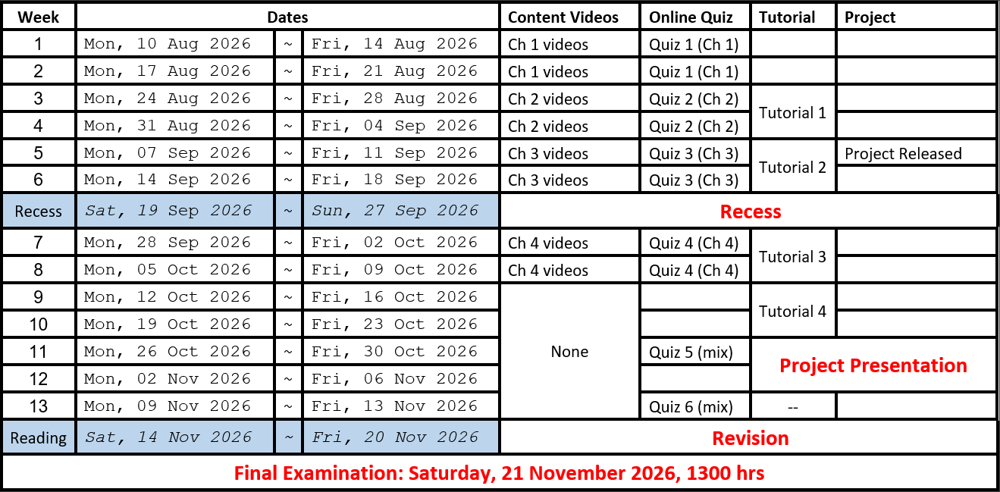
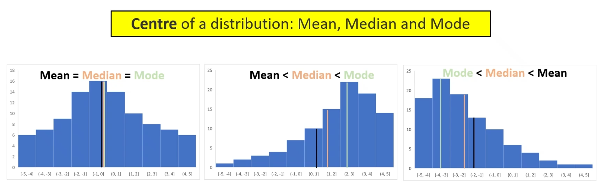
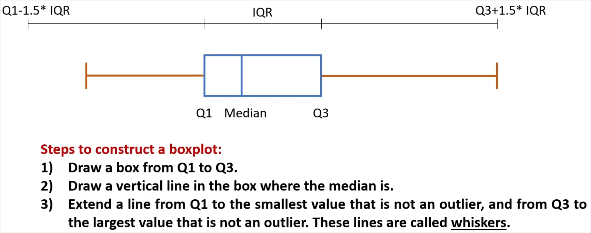

# GEA1000 Quantitative reasoning with data

| assessment | weight |
| --- | --- |
| online quizzes | 10% |
| tutorial participation | 15% |
| group project | 30% |
| final exam | 45% |

# Chapter 1: Getting Data
> Population of interest: group in which researcher has interest in drawing conclusions of
- population parameter: numerical fact about a population

> Sample: proportion of population selected for study

> estimate: an inference based on information from the sample

> Census: an attempt to represent the whole population
- Why not always do a census?
    - too costly - esp if population is huge
    - harmful (e.g. blood samples)
    - illogical (destructive testing)

> Sampling frame: pool of people to draw samples form

## Biases
Selection bias: biased selection of units
- imperfect sampling frame
- non-probability sampling

Non-response bias
- not interested, inconvenient, sensitive information

## Sampling methods
### Probability sampling
Sampled via a known randomized mechanism
- Simple Random - selected randomly **without replacement**
    - good representation but vulnerable to non-response
- Systematic - applying a selection interval k and a random starting point
    - Simpler process, bad representation
- Stratified - similar units grouped into strata, simple random done within each strata
    - Good representation, more information needed
- Cluster - units broken down into similar clusters, randomly sample fixed number of clusters (works well for large number of clusters)
    - Simpler process, high variability if clusters are dissimilar
### Non-probability sampling
- Convenience - proximity and availability
    - Selection & non-response bias
- Volunteer - actively seek volunteers
    - Selection & non-response bias

## Generalization
For sample statistics to be generalizable
- sampling frame >= population (no one left out)
- probability-based sampling
- large sample size - reduces variability
- minimum non-response + high response rate
- data accuracy

> estimate = parameter + bias + random error

## Variables
Attribute that can be measured or labelled
- Dataset: variables pertaining to a set of individuals

### Types
- independent: subject to manipulation (deliberate or non-deliberate)
- dependent: hypothesised to change based on independent variable manipulation

- categorical - label values that are mutually exclusive
    - ordinal - has an order (usually numerical)
    - nominal - no intrinsic ordering
- numerical - numerical values for which arithmetic operations make sense
    - discrete - set of numbers with gaps
    - continuous - range or interval

## Study designs
### Experimental
intentionally manipulates 1 variable to affect another
- provides evidence for cause-and-effect relationship
- split into treatment group and control group
    - use random assignment to reduce effect of external variables on result

Blinding: make subjects blind to which group they're in
- benefits of a placebo while circumventing the placebo effect
- assessors can also be blinded
- double blind: both subjects and assessors are blinded
### Observational
observes individuals and measures variables of interest
- provides evidence of 'association'

Types
- cohort - start with suspected cause, forward looking
    - useful for calculating actual risk
    - time and resource intensive, attrition over time
- case-control - start with outcome, backward looking
    - reliance on memory and medical records
    - unclear whether the outcome actually caused the investigated cause

# Chapter 2
## Categorical Data Analysis
### Tables and plots
Analysing 1 categorical variable
- frequency tables
- bar plots
    - dodged
    - stacked

2 categorical variables
- 2x2 contingency table
    - normalize with row percentages
- bar plots
    - dodged
    - stacked

| Category | Count |
| --- | --- |
| | |
### Marginal, conditional and joint proportions
> Marginal proportions: referring to 1 categorical variable only - p(Success)
> Conditional proportions: p(Success|X) - "proportion of success given X"
> Join proportions: p(Y and Failure) - use overall total as denominator

## Risk ratios
Measuring associations
- not valid for case-control studies due to lack of incidence proportion

Risk ratios aka relative risk
- "> 1": positive association
    - number indicates strength of association
- "= 1": no association
- "< 1": negative association
$$Risk = \frac{incidence proportion of exposed}{incidence proportion of unexposed}$$

## Odds ratios
$$Odds = \frac{number of times event occurs}{number of times event does not occur}$$
- useful for case-control studies
- always consistent with risk ratio
- also works with cohort studies but risk ratios are preferred

$$Odds ratio = \frac{odds of disease in exposed}{odds of disease in unexposed}$$

## Simpson's paradox
when a trend appears in all groups of data but disappears or reverses when groups get combined
- implies a confounding variable

> confounding variable: 3rd variable associated to the 2 variables under investigation

[Tutorial 2](./GEA1000_tutorial2.md)

# Chapter 3
## Summary statistics
### Measures of central tendency
Mean - average: $\bar{x} = \frac{x_1 + ... + x_n}{n}$
- Overall vs subgroup means
    - Overall always lies between sub
    - Overall is closer to the larger sub
- Proportion is a special case of mean (1 or 0)
- Properties:
    - Adding constants to a data set increases the mean by the constant
    - Multiplying constants scales the mean by the constant

Median: middle value (avg of 2 values if even)
- Properties: same as mean
- Overall vs subgroup medians
    - Overall always lies between sub group
    - Overall is NOT always closer to larger sub
- More robust to the effect of outliers than mean

Relationship between median and mean:
- Median and mean are similar = data is roughly symmetrically distributed

Mode: most frequent or peak of distribution
- also applicable for categorical variables

### Measures of dispersion
Standard deviation: $s_x = \sqrt{Variance}$
- $Variance = \frac{(x_1 - \bar{x})^2 + ... + (x_n - \bar{x})^2}{n - 1}$
- Properties
    - Always positive
    - Adding constants to the dataset does not affect $s_x$
    - Multiplying by constant c results in $|c|s_x$
- Comparing SD between variables:
    - $coefficient of variation = \frac{s_x}{\bar{x}} where \bar{x} \neq  0$

Interquartile range: $IQR = Q_3 - Q_1$
- Quartiles:
    - $Q_1 = 25^{th} percentile of data values$
    - $Q_3 = 75^{th} percentile of data$
- More robust to the effects of outliers compared to SD
## Univariate Data
Patterns in data
- Shape
    - Peak: unimodal or multimodal
    - Skewness

- Center
    - Mean, median, mode
- Spread
    - Range, SD

Common Patters:
- Normal distribution e.g. IQ score

Deviations
- Outliers

### Box plots
Components: Min, Q1, Median, Q3, Max
- Outliers
    - $ > Q_3 + 1.5 \times  IQR$
    - $ < Q_1 - 1.5 \times  IQR$

### Bivariate datasets
Deterministic relationships: value of one variable can be calculated from another
- e.g. Celsius to Fahrenheit

Non-deterministic or association:
- Natural variability exists in the measurement of 2 variables
- Avg of one var can be described given the avg of another

#### Visual analysis
Scatter plots
- Patterns
    - Direction - positive, negative or neither
    - Form - general shape
        - Linear
        - Non-linear
    - Strength: how closely data follows the form
- Deviation
    - Outliers

Correlation coefficients: measure of linear association
- value between -1 to 1
- sign --> positive, negative or no LINEAR relationship
- -1 or 1 --> perfect association
- Computation:
    1. convert data points into standard units
        - $SU_x = \frac{x - \bar{x}}{s_x}$
    2. $r = \frac{SU_x \times  SU_y}{n - 1}$
- Properties:
    - r is not affected by:
        - interchanging 2 variables
        - addition or multiplication of constants to dataset
- Limitations
    - correlation does not imply causation (confounding variables)
    - r value only measures LINEAR relationships
- Outliers
    - may increase or decrease the strength of r

Fallacies
- Ecological fallacy
- Atomistic fallacy
- Don't use correlations observed in sub groups to make conclusions about the overall data and vice versa

Regression
- Model relationship using straight line
    - $y = mx + c$
- Least squares
    - $e_i = difference between observed and predicted outcome$
    - Minimise $e_1^2 + ... + e_n^2$

slope vs correlation coefficient: $m = \frac{s_y}{s_x}r$

